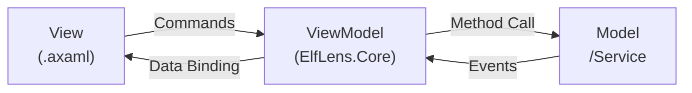

# ElfLens 演示 PPT 详细解释文档

---

## Slide 1 — 封面


---

## Slide 2 — 项目概述


---

## Slide 3 — 技术栈

### 客户端技术栈

| 技术 | 版本 | 在项目中的角色 |
|------|------|---------------|
| **Avalonia UI** | 12.0.4 | 整个 UI 层的基础框架。提供 XAML 标记语言、数据绑定引擎、控件库、样式系统、跨平台渲染后端 |
| **Fluent Dark** | 内建 | Fluent Design System 的暗色变体主题。通过 `App.axaml` 中的 `<FluentTheme />` 和 `RequestedThemeVariant="Dark"` 全局应用，所有按钮、文本框、TabControl、ScrollViewer 等控件自动获得深色配色 |
| **CommunityToolkit.Mvvm** | 8.4.2 | 微软官方维护的 MVVM 工具包。项目使用其**源生成器**功能（而非运行时反射），在编译时为 `[ObservableProperty]` 字段生成属性包装器、为 `[RelayCommand]` 方法生成 `ICommand` 实现、为 `[GeneratedRegex]` 静态方法生成编译时正则 |
| **SSH.NET** | 2025.1.0 | 纯 .NET 实现的 SSH 客户端库（原名 Renci.SshNet）。提供 `SshClient`（连接管理）、`SshCommand`（命令执行）、`ShellStream`（交互式 Shell 流）三个核心类。项目使用它建立到远程 Linux 的加密 SSH 连接 |
| **.NET 10** | 10.0.x | - |
| **C#** | 默认版本 | 项目中使用的关键特性：`record` 类型（不可变数据载体）、`partial class`（配合源生成器）、`GeneratedRegex`（编译时正则）、`using` 声明、异步流等 |
| **Avalonia.Desktop** | 12.0.4 | Avalonia 的桌面平台适配包。提供 `ClassicDesktopLifetime`，管理窗口生命周期、消息泵和平台原生集成 |
| **Cascadia Code / Inter** | 随 Avalonia 分发 | Cascadia Code 是微软开发的编程用等宽字体，用于所有代码面板（反汇编、寄存器、Shell 等）。Inter 是 UI 文本字体，由 Avalonia.Fonts.Inter 包引入，用于按钮、标签等通用控件 |

### 远程主机依赖

这些是远程 Linux 上需要安装的工具，ElfLens 本身不打包它们：

| 工具 | 用途 | 是否必须 |
|------|------|----------|
| **GDB** | GNU Debugger，调试核心。ElfLens 通过 SSH Shell 流向其发送 text-based 命令（`run`、`stepi`、`continue`、`info registers`、`disassemble /r` 等）并解析文本输出 | 是 |
| **GNU Binutils** | 包含 `objdump`（反汇编，用于静态分析面板）和 `readelf`（读取 ELF 头、节表、段表，用于文件信息面板） | 是 |
| **file** | Unix 标准命令，识别文件类型（`file /bin/ls → ELF 64-bit LSB executable`），用于文件信息面板 | 是 |
| **pwndbg** | 第三方 GDB 插件，提供增强的栈可视化（彩色堆栈视图、寄存器高亮、内存标注）。ElfLens 优先使用 pwndbg 的 `stack` 命令输出，不可用时回退到原生 GDB 的 `x/gx` | 否 |
| **checksec** | 安全分析工具（通常来自 pwntools），检查 ELF 的安全编译选项（NX/DEP、RELRO、Stack Canary、PIE）。不可用时 ElfLens 通过手动解析 `readelf` 输出来推断 | 否 |

### 项目结构树

```
ElfLens.slnx                     ← .NET 新格式解决方案文件（XML 格式）
├── src/ElfLens/                 ← 表现层项目（Avalonia 桌面应用）
│   └── *.axaml + *.axaml.cs     ← 10 个 View 的用户控件（XAML + Code-behind）
├── src/ElfLens.Core/            ← 逻辑层项目（.NET 类库）
│   ├── ViewModels/              ← 11 个 ViewModel（MVVM 的 VM 层）
│   ├── Services/                ← 2 个服务（ISshService 接口 + SshService 实现）
│   └── Models/                  ← 2 个模型（SshConnectionInfo + ShellSession）
└── docs/ · tests/ · release/    ← 文档 / 测试（空目录）/ 预构建发布
```

两个项目在 `ElfLens.slnx` 中定义，`ElfLens` 通过 `<ProjectReference>` 引用 `ElfLens.Core`，形成"桌面应用依赖类库"的标准 .NET 项目结构。

---

## Slide 4 — 系统架构

### 分层架构（Layered Architecture）

#### 第一层：Presentation Layer（表现层）

**所属项目**：`ElfLens`（Avalonia Desktop App）

**技术构成**：

| 组件 | 要点 | 说明 |
|------|------|------|
| Views | XAML（.axaml） | -                                                            |
| Data Binding | Compiled Bindings | 项目启用 `AvaloniaUseCompiledBindingsByDefault`，绑定时编译验证路径，性能和安全性优于反射绑定。`ItemsControl` 中的动态 Token 列表需显式 `x:CompileBindings="False"` |
| Converters | `IValueConverter` | 四个自定义值转换器，负责将 ViewModel 的数据类型转换为 UI 渲染属性（hex string → SolidColorBrush、bool → background color 等） |
| ViewLocator | `IDataTemplate` | 通过反射和命名约定将 ViewModel 类型映射到 View 类型，无需手动注册 |
| Dark Theme | FluentTheme | 全局应用 Fluent Dark 主题，所有内建控件自动获得深色样式 |

**设计特点**：
- 表现层**不包含任何业务逻辑**——View 的 code-behind 只处理 UI 特定事件（如 `ScrollViewer.ScrollToEnd()`、`TextBox.Focus()`、`ContextMenu` 弹出位置计算）
- `ViewModel` 通过 Avalonia 的 `DataContext` 属性注入到 View
- `View` 通过 `{Binding PropertyName}` 语法绑定到 ViewModel 的属性

#### 第二层：ViewModel Layer（视图模型层）

**所属项目**：`ElfLens.Core`

**技术构成**：

| 组件 | 要点 | 说明 |
|------|------|------|
| MainViewModel | 手动组合根 | 应用编排中心。创建所有面板 ViewModel，分配面板到 4 个区域，连接所有跨面板事件 |
| PanelViewModel 体系 | 继承树 | 7 个面板 ViewModel + 3 个抽象基类，形成清晰的继承层次 |
| [ObservableProperty] | 源生成器 | 标记 `private` 字段 → 编译时生成 `public` 属性 + `INotifyPropertyChanged` 通知 + `partial void OnXxxChanged()` 钩子方法 |
| [RelayCommand] | 源生成器 | 标记 `private` 方法 → 编译时生成 `ICommand` 属性，支持 `CanExecute` 谓词和异步执行 |

**PanelViewModel 继承体系**：

```
ObservableObject (CommunityToolkit.Mvvm 提供)
└── ViewModelBase                   ← 项目的 ViewModel 基类（空，预留扩展点）
    ├── ConnectPageViewModel        ← 不继承 PanelViewModel（连接页不是面板）
    ├── MainViewModel               ← 不继承 PanelViewModel（它是编排器，不是面板）
    └── PanelViewModel              ← 抽象基类，定义 Title + Zone
        ├── SessionPanelViewModel   ← 抽象基类，添加 ShellSession + SetSession()
        │   ├── BreakpointPanelViewModel
        │   ├── RegistersPanelViewModel
        │   └── StackPanelViewModel
        ├── ShellPanelViewModel     ← 双模式：可接受 ISshService（SSH Shell）或 ShellSession（GDB Shell）
        ├── FileInfoPanelViewModel
        ├── DisassemblyPanelViewModel
        └── GdbDisasmPanelViewModel
```

**设计特点**：
- `PanelViewModel` 抽象类定义每个可停靠面板的两个核心属性：`Title`（TabControl 的标签页标题）和 `Zone`（Left/Center/Right/Bottom 枚举值）
- `SessionPanelViewModel` 进一步抽象化"需要 GDB 会话的面板"。它暴露 `ShellSession?` 属性和 `SetSession(ShellSession?)` 方法。当 MainViewModel 收到 `SessionChanged` 事件时，只需对所有 SessionPanelViewModel 子类调用 `SetSession()`
- 这种设计使得添加新面板非常简单——只需继承 `PanelViewModel` 或 `SessionPanelViewModel`，MainViewModel 中的连接代码自动生效

#### 第三层：Service Layer（服务层）

**所属项目**：`ElfLens.Core`

**技术构成**：

| 组件 | 要点 | 说明 |
|------|------|------|
| ISshService | 接口 | 定义 SSH 服务契约：`ConnectAsync`、`DisconnectAsync`、`ExecuteCommandAsync`、`CreateShellSessionAsync` |
| SshService | SSH.NET 封装 | 实现接口。内部持有 `Renci.SshNet.SshClient` 实例，通过 `Task.Run` 将 SSH.NET 的同步 API 包装为异步 |

**SshService 的三种访问模式**：

1. **ExecuteCommandAsync**：一次性命令执行。内部调用 `SshClient.CreateCommand()` + `cmd.Execute()`，30 秒超时。用于无状态工具调用（`file`、`readelf`、`objdump`）

2. **CreateShellSessionAsync**：创建持久化 Shell 流。内部调用 `SshClient.CreateShellStream("xterm-256color", 200, 40, 800, 600, 65536)`，创建一个 200 列 × 40 行的伪终端，64KB 缓冲区。返回 `ShellSession` 包装器，后续可以继续发送命令

3. **隐式 Shell 复用**：`ShellPanelViewModel` 有两种构造模式——从 `ISshService` 创建全新的 ShellSession（用于通用 SSH 终端），或复用已有的 GDB ShellSession（用于 GDB Shell 标签页）。这种设计避免了创建重复的 SSH 连接

**设计特点**：
- 接口抽象使得远程通信的具体实现（SSH.NET）可以被替换（例如替换为 Telnet 或本地进程调用），而不影响上层
- `Task.Run` 包装是一个务实的选择——SSH.NET 的 `SshCommand.Execute()` 和 `ShellStream.Read()` 是同步阻塞的，通过 `Task.Run` 将其离线到线程池，避免阻塞 Avalonia 的 UI 线程
- 异步方法使用 `ConfigureAwait(false)` 避免在 UI 线程上恢复执行（因为在 `Task.Run` 的上下文中不需要）

#### 第四层：Model Layer（模型层）

**所属项目**：`ElfLens.Core`

**技术构成**：

| 组件 | 类型 | 说明 |
|------|------|------|
| SshConnectionInfo | DTO（class） | 连接参数的数据载体。包含 host、port、username、auth method（密码/私钥）、target binary path。提供 `IsValid` 验证属性 |
| ShellSession | 流包装器（class） | 整个系统最底层的 I/O 抽象。封装 SSH.NET 的 `ShellStream`，提供异步命令/响应模式。详见 Slide 9 |
| Token | record | 语法高亮的最小单元：`Text` + `Color`（hex string）+ `NavigateTo?`（可选导航目标） |
| HighlightedLine | record | 反汇编的一行指令：`List<Token>` + `IsCurrent` + `IsBreakpoint` + `IsBreakpointDisabled` |
| FunctionItem | ObservableObject | 一个函数的反汇编块：`Name` + `Address` + `Instructions`（可折叠/展开） |
| RegisterEntry | record | 一个 CPU 寄存器：`Name` + `HexValue` + `DecValue` |
| StackFrameItem | ObservableObject | 调用栈的一帧：`FrameNum` + `Function` + `Address`（可展开显示栈内存） |
| BreakpointEntry | ObservableObject | 一个断点：`Location` + `GdbNumber?` + `ResolvedAddress?` + `IsEnabled` |

**设计特点**：
- `record` 类型用于不可变数据（Token、HighlightedLine、RegisterEntry 等），确保从 ViewModel 传递到 View 的数据不会被意外修改
- `ObservableObject` 用于需要变更通知的数据（FunctionItem、StackFrameItem、BreakpointEntry），因为这些数据需要在 UI 中动态更新（高亮变化、折叠/展开状态变化）
- `ShellSession` 是唯一直接与外部 I/O 交互的模型类——它持有 SSH.NET 的 `ShellStream` 引用，管理后台读取线程和命令队列

### MVVM 数据流

MVVM（Model-View-ViewModel）是微软在 WPF 时代推广的 UI 架构模式，ElfLens 严格遵循它：



- **View → ViewModel**：通过 `{Binding}` 数据绑定（单向或双向）和 `{Command}` 命令绑定
- **ViewModel → Model/Service**：通过普通方法调用（await `sshService.ExecuteCommandAsync(...)`）
- **Model/Service → ViewModel**：通过返回值和事件（`ShellSession.OnOutput`）
- **ViewModel → View**：通过 `INotifyPropertyChanged`（由 `[ObservableProperty]` 自动生成）

**编译绑定（Compiled Bindings）**：Avalonia 支持两种绑定模式——反射绑定（运行时通过反射解析属性路径）和编译绑定（编译时生成 IL 代码直接访问属性）。ElfLens 启用编译绑定，但对动态数据（如 `ItemsControl` 中的 Token 列表）需要选择退出（`x:CompileBindings="False"`），因为 Token 的 `NavigateTo` 属性可为 null，编译绑定无法处理这种场景

**ViewLocator**：`IDataTemplate` 实现，使用命名约定自动将 ViewModel 类型映射到 View 类型。约定规则：
```
ElfLens.Core.ViewModels.XxxViewModel → ElfLens.Views.XxxView
```
实现方式：用字符串替换将 `"ViewModel"` 替换为 `""`，`"ElfLens.Core"` 替换为 `"ElfLens"`，然后 `Type.GetType()` 反射获取 View 类型，`Activator.CreateInstance()` 创建 View 实例。

### 事件驱动协调

MainViewModel 作为中心编排器，连接 7 种跨面板事件：

| 事件 | 触发源 | 订阅者 | 数据流 |
|------|--------|--------|--------|
| **SessionChanged** | GdbDisasmPanel | Breakpoint / Registers / Stack / Shell | `ShellSession` 引用传递，同时自动创建或移除 GDB Shell 标签页 |
| **BreakpointRequested** | DisassemblyPanel（静态）/ GdbDisasmPanel（动态） | BreakpointPanel | 地址字符串 → `AddFromDisasm(address)`，右键菜单触发 |
| **BlocksChanged** | GdbDisasmPanel | MainViewModel | 新函数块被加载 → 调用 `MarkBreakpoints()` 为新块标记断点位置 |
| **OnChanged**（回调） | BreakpointPanel | MainViewModel | 断点增删改 → 同时刷新静态反汇编和 GDB 反汇编面板的断点标记 |
| **NavigateToFunction** | DisassemblyPanel | 其 View code-behind | 地址字符串 → `ScrollViewer.ScrollTo()` 滚动到目标函数 |
| **ScrollToBlock** | GdbDisasmPanel | 其 View code-behind | 当前 PC 所在的函数块 → 自动展开 + 滚动定位 |

事件系统使得面板之间保持松散耦合——例如，`DisassemblyPanelViewModel` 不知道 `BreakpointPanelViewModel` 的存在，它只触发 `BreakpointRequested` 事件，由 MainViewModel 负责路由。

---

## Slide 5 — 核心功能模块

### 1. SSH 远程连接

**功能**：
- 通过 SSH 协议连接到远程 Linux 主机
- 支持两种认证方式：
  - **密码认证**：`PasswordAuthenticationMethod`
  - **私钥文件认证**：`PrivateKeyAuthenticationMethod`
- 连接成功后，SshService 实例被注入到 MainViewModel 中供所有面板使用

### 2. ELF 文件分析

**功能**：
- 调用 `file <binary>` — 识别文件类型（ELF 64-bit / ELF 32-bit / 是否 stripped）
- 调用 `readelf -h` — 解析 ELF 头信息（入口点地址、程序头数量、节头数量）
- 调用 `readelf -SW` — 解析节表（.text / .data / .bss / .rodata 等）
- 调用 `checksec` — 检查安全编译选项（NX、RELRO、Stack Canary、PIE）

**安全属性含义**：

| 属性 | 全称 | 防御的攻击 | 检测方法 |
|------|------|-----------|----------|
| **NX** | No-eXecute | 栈上的 shellcode 执行 | 检查 GNU_STACK 段的 PF_X 标志 |
| **RELRO** | RELocation Read-Only | GOT 表覆写攻击 | 检查 GNU_RELRO 段的存在和大小 |
| **Stack Canary** | 栈金丝雀 | 栈缓冲区溢出 | 检查符号表中是否存在 `__stack_chk_fail` |
| **PIE** | Position Independent Executable | 固定地址 ROP 攻击 | 检查 ELF 类型是否为 DYN（共享对象） |

**渐进增强**：`checksec` 工具不可用时，自动回退到手动解析 `readelf -lW`（程序头）和 `readelf -sW`（符号表）来推断安全属性。

### 3. 静态反汇编

**功能**：
- 通过 SSH 执行 `objdump -d <binary>`，获取完整的反汇编输出
- 将输出解析为 `FunctionItem` 列表（函数名 + 起始地址 + 指令列表）
- 每个函数支持**折叠/展开**（点击函数头切换 `IsExpanded` 属性）
- 函数内的汇编指令使用彩色 Token 渲染
- 函数引用（如 `call <printf>`）是**可点击的导航链接**——点击后自动滚动到对应函数

**技术实现**：`DisassemblyPanelViewModel` 调用 `SshService.ExecuteCommandAsync("objdump -d ...")` 获取文本输出，使用正则表达式分两步解析——先匹配函数头（`^[0-9a-f]+ <(.+)>:$`），再匹配指令行（地址 + 字节码 + 助记符 + 操作数）。`DisassemblyHighlighter.Tokenize()` 对每条指令进行语法着色。

### 4. 交互式 GDB 调试

**功能**：
- 启动 GDB：`gdb -q <binary>` 然后 `run`
- 调试控制：
  - **Step Into** (`stepi`)：执行一条机器指令，如果当前指令是 call 则进入被调用函数
  - **Step Over** (`nexti`)：执行一条机器指令，跳过 call 指令不进入
  - **Continue** (`continue`)：继续执行直到下一个断点或程序结束
  - **Restart**：终止当前 GDB 进程并重新启动
  - **Stop**：发送中断信号停止程序执行
- 当前 PC（程序计数器）所在行以**黄色背景**高亮
- 当前执行所在的函数**自动展开**，并**自动滚动**到可见区域
- 首次访问的函数**懒加载**反汇编（`disassemble /r`），已访问的函数缓存复用

**技术实现**：`GdbDisasmPanelViewModel` 创建专用的 `ShellSession`，通过 `CaptureOutputAsync` 发送 GDB 命令。每次执行步进操作后自动刷新：先获取当前 PC（`info registers pc`），然后确定所在函数，最后获取该函数的反汇编（`disassemble /r`）。

### 5. 断点管理

**功能**：
- 添加断点：
  - **按函数名**：`break *<function>`
  - **按函数名 + 偏移**：`break *<function>+<offset>`
  - **按地址**：`break *<address>`
- 操作：
  - 启用/禁用单个断点（`enable <num> / disable <num>`）
  - 删除单个断点（`delete <num>`）
  - 批量应用到 GDB（一次性发送所有已启用的断点命令）
- 右键菜单：在反汇编面板的任意指令行上右键可以设置断点
- 可视化标记：断点行左侧显示红色（启用）或橙色（禁用）的边框

**技术实现**：`BreakpointPanelViewModel` 发送 `break <location>` 命令后，解析 GDB 的响应（如 `Breakpoint 1 at 0x4048b0`）获取 GDB 分配的内部编号和解析后的实际地址。`FunctionItem.MarkBreakpoints()` 静态方法遍历所有函数的指令行，通过计算字节偏移量精确匹配断点位置并设置 `IsBreakpoint` / `IsBreakpointDisabled` 标志。

### 6. 寄存器 & 调用栈

**寄存器面板**：
- 发送 `info registers` 命令
- GDB 返回每行格式如 `rax 0x0000000000000001 1`（寄存器名 + 十六进制值 + 十进制值）
- 正则解析为 `RegisterEntry` 列表

**调用栈面板**：
- 发送 `bt`（backtrace）命令获取调用栈帧列表
- 每个帧显示：帧编号、函数名、地址
- **可展开**：点击展开一个帧后：
  1. 切换到该帧的上下文（`frame N`）
  2. 获取帧边界（`info frame` → "frame at" 和 "caller of frame at" 地址）
  3. 计算栈范围（`(callerAddr - frameAddr) / 8 + 2`，限制在 4~64 行）
  4. 优先使用 pwndbg 的 `stack N` 命令（彩色栈视图），不可用时回退到 `x/Ngx $rsp`
  5. 恢复上下文到帧 0（`frame 0`）

---

## Slide 6 — 工作区布局

### 布局设计理念

ElfLens 的工作区布局参考了专业逆向工具（IDA Pro、x64dbg、Ghidra）的多面板停靠模式。主窗口使用一个 3×2 的 Grid 布局，列宽和行高可通过 `GridSplitter` 拖拽调整。

```
┌─────────────┬──────────────────────┬─────────────┐
│  Left       │  Center              │  Right      │
│             │                      │             │
│             │                      │             │
│  Registers  │  Disassembly         │  File Info  │
│  ─────────  │  ─────────────────── │  ─────────  │
│  Stack      │  GDB Disasm          │  Breakpoints│
│             │                      │             │
├─────────────┴──────────────────────┴─────────────┤
│  Bottom                                          │
│  SSH Shell  │  GDB Shell                         │
└──────────────────────────────────────────────────┘
```

### 各区域职责

| 区域 | 面板 | 职责 |
|------|------|------|
| **Left** | Registers + Stack | 程序运行时状态：CPU 寄存器和调用栈 |
| **Center** | Disassembly + GDB | 代码分析主区域：静态反汇编和实时调试 |
| **Right** | File Info + Breakpoints | 辅助信息：二进制属性和断点列表 |
| **Bottom** | SSH Shell + GDB Shell | 终端输入输出：通用命令和 GDB 控制台 |

### 技术实现

MainWindow 使用嵌套的 `Grid` 布局：
- 外层 Grid：3 列（Left / Center / Right）+ `GridSplitter` + 1 行（主内容区）+ `GridSplitter` + 1 行（Bottom）
- 每个区域内的 `TabControl` 绑定到 `MainViewModel` 中对应的 `ObservableCollection<PanelViewModel>`
- `TabControl.ItemsSource` + `ViewLocator` 自动将每个 `PanelViewModel` 解析为其对应的 `View`

---

## Slide 7 — 反汇编与语法高亮

### 自定义 Token 渲染管道

ElfLens 实现一套轻量级的 Token 渲染管道。

**Token** 记录类型：

```csharp
record Token(string Text, string Color, string? NavigateTo);
```
- `Text`：要显示的文本片段
- `Color`：hex 颜色字符串（如 `"#4FC3F7"`），由 `HexToBrushConverter` 在 UI 层转换为 `SolidColorBrush`
- `NavigateTo`：可选。如果非 null，Token 可点击，点击后触发导航事件

### 配色方案

配色参考了 VSCode Dark+ 主题和 IDA Pro 的反汇编显示习惯：

| Token 类型 | 颜色 | Hex | 匹配规则 |
|-----------|------|-----|----------|
| **地址** | 蓝灰 | #546E7A | 行首的 `4048b0:` 格式十六进制地址 |
| **字节码** | 蓝灰 | #546E7A | 操作码的原始十六进制字节（`55`、`48 89 e5` 等） |
| **call 指令** | 绿色 | #81C784 | 助记符为 `call` 或 `callq` |
| **ret 指令** | 红色 | #EF5350 | 助记符为 `ret`、`retq`、`iret`、`sysret` 等 |
| **分支指令** | 橙色 | #FFB74D | 助记符为 `jmp`、`je`、`jne`、`jg`、`jl`、`ja`、`jb` 等条件/无条件跳转 |
| **寄存器** | 紫色 | #CE93D8 | `%rax`、`%rbp`、`%rsp`、`%xmm0` 等 AT&T 风格 % 前缀寄存器名 |
| **十六进制值** | 金色 | #FFE082 | `$0x10`、`0x4048b0` 等立即数和地址引用 |
| **函数引用** | 青色 | #4FC3F7 | `<main>`、`<printf@plt>` 等尖括号函数引用（可点击导航） |
| **注释** | 暗绿 | #6A9955 | `# comment` 或 `// comment` 格式的注释 |

**AT&T 汇编语法**：ElfLens 处理的 objdump 和 GDB 输出使用 AT&T 语法（GNU 工具链默认），其特点：
- 源操作数在前，目标操作数在后：`mov %rsp, %rbp`（rsp 的值移入 rbp）
- 寄存器以 `%` 为前缀：`%rax`、`%rbp`
- 立即数以 `$` 为前缀：`$0x10`
- 内存操作数使用 `displacement(base, index, scale)` 格式：`-0x8(%rbp)`

---

## Slide 8 — 交互式 GDB 调试

### 调试生命周期

**步骤详解**：

1. **启动 GDB**：`ShellSession.SendCommandAsync("gdb -q <binary>")`。`-q` 表示 quiet 模式，跳过 GDB 的启动横幅。此时 GDB 加载二进制文件但尚未运行。

2. **加载程序**：`SendCommandAsync("run")`。GDB 开始执行目标程序。如果有断点设置在程序入口附近，程序将在第一个断点处暂停。

3. **连接面板**：`GdbDisasmPanelViewModel` 触发 `SessionChanged` 事件，携带当前的 `ShellSession`。MainViewModel 处理该事件：
   - 对 BreakpointPanel、RegistersPanel、StackPanel 调用 `SetSession(e.Session)`
   - 创建 GDB Shell 标签页（复用同一个 ShellSession）
   - 批量应用所有已保存的断点

4. **开始调试**：用户点击调试控制按钮。每次操作后自动触发面板刷新。

5. **刷新面板**：
   - `info registers pc` → 获取当前程序计数器（PC/RIP）的值
   - 根据 PC 值确定当前执行所在的函数
   - `disassemble /r <function>` → 获取该函数带原始字节的反汇编
   - 更新 `FunctionBlocks` 集合（如果是新函数则添加，已存在则更新）
   - 解析反汇编输出为彩色 Token
   - 设置当前 PC 行的 `IsCurrent = true`
   - 自动展开当前函数块
   - 触发 `ScrollToBlock` 事件，View 层的 ScrollViewer 滚动到当前指令

### 调试控制

**Step Into (stepi)**：执行一条机器指令。如果当前指令是 `call` 或 `callq`，CPU 会跳转到被调用函数的第一条指令。对应 x86 的 `stepi` 命令（step instruction），每次执行一条指令。

**Step Over (nexti)**：执行一条机器指令，但如果是 `call` 指令，GDB 会在被调用函数内部设置一个临时断点，让程序执行到该函数返回后再暂停。即"跳过"函数调用。对应 `nexti` 命令。

**Continue**：继续执行程序直到遇到下一个断点、程序正常结束、或收到中断信号。对应 `continue` 命令。

**Restart**：终止当前 GDB 进程，重新运行 `gdb -q <binary>` 和 `run`。适用于需要从头开始调试的场景。重新启动后，所有断点会被自动恢复。

**Stop**：发送中断信号（Ctrl+C）给 GDB 进程，使程序在当前位置暂停。对应在 GDB 终端中按 Ctrl+C。

**右键设置断点**：在反汇编面板的任何指令行上右键，触发上下文菜单。选择"设置断点"后，当前指令的地址被传递到 BreakpointPanelViewModel，自动添加断点并同步到 GDB。

### 函数块管理

**FunctionItem** 是显示反汇编代码的核心数据模型：

```csharp
public partial class FunctionItem : ObservableObject
{
    public string Name { get; set; }                         // 函数名，如 "main"
    public string Address { get; set; }                      // 起始地址，如 "4048b0"
    public List<HighlightedLine> Instructions { get; set; }  // 指令列表
    [ObservableProperty] private bool _isExpanded = true;    // 折叠/展开状态
}
```

关键设计决策：

- **懒加载（Lazy Fetch）**：GDB 面板不会一次性获取整个二进制文件的反汇编。而是在首次访问一个函数时才调用 `disassemble /r <function>`。在调试大型程序时，这显著减少了网络传输量。

- **缓存复用**：已加载的函数反汇编保存在 `FunctionBlocks` 集合中，后续访问同一函数时直接使用缓存，不再向 GDB 发送请求

- **自动展开**：当前 PC 所在的函数块自动设置 `IsExpanded = true`，其他函数默认折叠。这使得用户可以专注于当前正在执行的代码，同时快速浏览周围的函数名

- **视觉标记**：
  - 当前行：黄色背景（`CurrentBgConverter` 在 `IsCurrent = true` 时返回 `#FFF9C4`）
  - 断点行：红色左边框（`BreakpointBorderConverter` 在 `IsBreakpoint = true` 且 `IsEnabled = true` 时返回红色）
  - 禁用断点：橙色左边框

---

## Slide 9 — SSH 远程通信设计

### 核心问题

GDB 是一个**有状态的交互式程序**（stateful interactive program），其行为模式与典型的 CLI 工具完全不同：

- **CLI 工具**（如 `ls`、`objdump`）：输入命令 → 输出结果 → 程序退出。可以使用 SSH 的单次命令执行（`SshCommand.Execute()`）
- **GDB**：启动后进入 REPL（Read-Eval-Print Loop）模式。需要保持进程运行，接受多次命令输入，每次命令的输出依赖于之前的命令上下文

这意味着 ElfLens 不能简单地用 `ExecuteCommandAsync("gdb -q binary; run; stepi")` 来操作 GDB——每个命令的发送时机和输出解析都依赖于前一个命令的结果。

### ShellSession 解决方案

`ShellSession` 是这个问题的核心解决方案。它封装了一个持久的 SSH Shell 流（`ShellStream`），并提供一套异步命令/响应模式。

**Shell 流初始化**：
```csharp
var stream = sshClient.CreateShellStream(
    "xterm-256color",  // 终端类型
    200, 40,           // 200 列 × 40 行
    800, 600,          // 窗口大小（像素）
    65536              // 缓冲区大小（字节）
);
```

`xterm-256color` 终端类型使得 GDB 可以使用彩色输出（语法高亮、颜色提示），提高了输出可读性。

**后台读取循环**：
```csharp
// ShellSession 构造函数中启动
Task.Run(async () => {
    var buffer = new byte[4096];
    while (!_cts.IsCancellationRequested) {
        var bytesRead = await _shellStream.ReadAsync(buffer, 0, buffer.Length);
        if (bytesRead > 0) {
            var text = Encoding.UTF8.GetString(buffer, 0, bytesRead);
            text = AnsiRegex().Replace(text, "");  // 剥离 ANSI 转义序列
            text = text.Replace("\r\n", "\n");     // 标准化换行符
            lock (_outputLock) { _outputBuffer.Append(text); }
            OnOutput?.Invoke(text);                // 通知订阅者（Shell 面板实时显示）
        }
    }
});
```

关键点：
- `ReadAsync` 是**阻塞式**的——它会等待直到有数据可读或 Shell 流关闭
- ANSI 转义序列（如 `\x1b[32m` 设置绿色前景色）对 GDB 的命令响应解析有害，需要过滤掉
- `[GeneratedRegex]` 将 ANSI 正则编译为编译时源代码，避免每次调用时的运行时编译开销
- `OnOutput` 事件用于 Shell 面板的实时终端模拟——用户可以看到 GDB 输出的"逐字符"到达

**CaptureOutputAsync — 统一命令/响应模式**：

```csharp
public async Task<string> CaptureOutputAsync(
    string command,
    int timeoutMs = 800,
    Func<string, bool> stopPredicate = null)
```

这是整个项目中使用频率最高的方法。所有面板的 GDB 交互都通过它进行。

执行流程：
1. `await _writeSemaphore.WaitAsync()` — 获取写锁。Shell 流是**全双工**的，但写入必须序列化以避免两个并发写入导致输出交错
2. 清空累积缓冲区
3. `_shellStream.WriteLine(command)` — 通过 SSH Shell 流发送命令
4. 进入轮询循环，每次迭代：
   - 短暂等待（10~20ms 轮询间隔）
   - 检查累积缓冲区是否满足停止条件：
     - 自定义谓词返回 `true`？
     - 包含 GDB 提示符（`(gdb)` 或 `pwndbg>`）？
     - 累积字符超过 8000？（安全上限，防止无限等待）
     - 已过 `timeoutMs` 毫秒？
5. `_writeSemaphore.Release()` — 释放写锁
6. 返回累积的文本字符串

**停止条件的设计考量**：
- **GDB 提示符**是最通用的停止条件，适用于大多数标准 GDB 命令（`stepi`、`continue`、`info registers` 等）
- **自定义谓词**用于特殊情况。例如 `info breakpoints` 在没有断点时输出 `"No breakpoints."` 然后返回提示符，但如果有断点，输出中包含 `"Num"` 表头。`stopPredicate` 允许灵活匹配
- **8000 字符上限**是安全措施，防止 GDB 输出大量数据时无限循环（如 `disassemble` 一个特别大的函数）
- **800ms 超时**是默认兜底机制，但实际使用中几乎所有命令都在 100~300ms 内完成

### 三种访问模式

**模式 1：ExecuteCommandAsync — 一次性命令执行**

```csharp
public async Task<string> ExecuteCommandAsync(string command, int timeout = 30000)
```

用于无状态的命令行工具：`file`、`readelf`、`objdump`、`checksec`。内部使用 `SshClient.CreateCommand()` + `cmd.Execute()`，命令执行完毕后 SSH 通道关闭，没有持久状态。

**模式 2：CreateShellSessionAsync — 持久化 Shell 流**

用于通用 SSH 终端面板。用户可以在终端中执行任意命令（`ls`、`cd`、`cat`、`vim` 等），命令之间有状态（当前目录、环境变量等）。通过 `ShellPanelViewModel` 提供命令历史记录（上下箭头键导航）。

**模式 3：GDB Shell 复用 — 共享 ShellSession**

在调试模式启动时，`GdbDisasmPanelViewModel` 创建自己的 `ShellSession`（内部运行 GDB 进程）。这个 `ShellSession` 被**共享**给：
- `BreakpointPanelViewModel`（发送 `break`、`info breakpoints` 等命令）
- `RegistersPanelViewModel`（发送 `info registers`）
- `StackPanelViewModel`（发送 `bt`、`info frame`、`stack N`）
- GDB Shell 面板（用户可以在此直接输入 GDB 命令）

所有面板共享同一个 GDB 进程上下文，因此断点的设置会影响步执行为，栈检查可以访问当前调试状态。

---

## Slide 10 — 工程亮点

### 1. MVVM 源码生成器

CommunityToolkit.Mvvm 使用 C# 的 **Source Generator** 机制（Roslyn 编译器的扩展功能），在编译时分析标记了特性的代码，生成额外的 C# 源代码文件，然后一起编译。

**传统 MVVM 需要手写**：
```csharp
private string _host = "";
public string Host {
    get => _host;
    set {
        if (_host != value) {
            _host = value;
            PropertyChanged?.Invoke(this, new PropertyChangedEventArgs(nameof(Host)));
            ConnectCommand.NotifyCanExecuteChanged();
        }
    }
}
```

**ElfLens 只需写**（使用源生成器）：
```csharp
[ObservableProperty]
private string _host = "";
// 编译后自动生成 public string Host { get; set; }
// + INotifyPropertyChanged 通知 + OnHostChanged() 钩子
```

源生成器的优势：
- **零运行时开销**：代码在编译时生成，运行时只是普通方法调用，不涉及反射
- **编译时错误检测**：错误的使用方式（如将 `[ObservableProperty]` 放在非字段上）在编译时报错
- **代码可审计**：生成的文件在 `obj/` 目录中可查看，开发者可以看到完整的生成代码

**GeneratedRegex 的性能优势**：
```csharp
[GeneratedRegex(@"\x1b\[[0-9;]*[a-zA-Z]")]
private static partial Regex AnsiRegex();
```
传统 `new Regex(pattern)` 在每次调用时都可能进行正则编译。`[GeneratedRegex]` 在编译时生成一个专用的、高度优化的正则匹配引擎源代码，避免运行时编译。对于在热路径上频繁调用的 ANSI 过滤（Shell 后台读取循环每秒可能触发数十次），这个优化有实际意义。

### 2. 事件驱动面板协调

事件驱动架构（Event-Driven Architecture）的核心思想是：组件之间不直接调用，而是通过事件总线（或直接的事件委托）进行通信。

在 ElfLens 中，MainViewModel 既是组合根（创建所有依赖），也是事件总线（连接所有事件）：

```csharp
// 断点变更 → 刷新两个独立的反汇编面板
breakpointPanel.OnChanged += () =>
{
    var bps = breakpointPanel.GetFuncBreakpoints();  // (func, offset, enabled)[]
    disasmPanel.MarkBreakpoints(bps);    // 更新静态反汇编
    gdbDisasm.MarkBreakpoints(bps);      // 更新 GDB 反汇编
};
```

这种设计的优势：
- **松耦合**：`BreakpointPanelViewModel` 不知道哪些面板需要断点标记信息，它只负责通知"断点变更了"。由 MainViewModel 决定如何处理这个事件
- **可扩展**：添加新面板只需在 MainViewModel 中注册新的事件处理，不需要修改现有面板的代码
- **圆依赖消除**：面板之间不相互引用（`DisassemblyPanel` 不持有 `BreakpointPanel` 的引用，反之亦然），避免了循环依赖

### 3. Token 导航系统

在传统的代码编辑器（如 VS Code）中，Ctrl+Click 跳转到定义是通过语言服务器协议（LSP）实现的，需要完整的语义分析。ElfLens 的反汇编没有语义信息，但有一个简单的模式：指令操作数中的 `<function>` 引用对应反汇编输出中的函数定义。

Token 导航系统利用了这一模式：
- 每个 `Token` 的 `NavigateTo` 字段携带目标函数地址
- UI 渲染时，`NavCursorConverter` 检查 `NavigateTo != null`，设置光标为 `Hand`（手型光标）
- 用户点击时，PointerPressed 事件 → 提取 Token 的 `NavigateTo` → 触发 `NavigateToFunction` 事件 → View code-behind 操作 `ScrollViewer` 滚动到目标函数

```csharp
// View 层的点击处理（简化）
void OnTokenTapped(object sender, TappedEventArgs e)
{
    var textBlock = (TextBlock)sender;
    var token = (Token)textBlock.DataContext;
    if (token.NavigateTo != null)
        ViewModel.NavigateToFunctionCommand.Execute(token.NavigateTo);
}
```

### 4. 渐进增强策略

渐进增强（Progressive Enhancement）是 Web 开发中的概念，ElfLens 将其应用于远程工具链管理：优先使用功能更强的工具，不可用时自动回退。

**示例 1：安全分析**
```
优先: checksec → 解析结构化输出
回退: readelf -lW + readelf -sW → 手动解析推断
```
`checksec` 输出如 `"NX: ENABLED"` 直接可读。但它是 pwntools 的一部分，不是标准安装。回退时，从 `readelf -lW` 的 GNU_STACK 段标志位判断 NX，从 GNU_RELRO 段的存在判断 RELRO 等。

**示例 2：栈内存可视化**
```
优先: pwndbg stack N → 彩色格式化输出
回退: x/Ngx $rsp → 原生 GDB 十六进制转储
```
`StackHighlighter.Tokenize()` 通过检测输出中是否包含 Unicode 绘制字符（`│`、`◂─`）来自动判断格式。pwndbg 格式提供更多上下文（函数名标注、寄存器引用、栈帧分隔线），而 `x/gx` 格式只显示地址和十六进制值。

**示例 3：双模式 ShellPanel**
```
SSH 模式: ShellPanelViewModel(SshService) → 创建新 ShellSession → 通用终端
GDB 模式: ShellPanelViewModel(ShellSession, title) → 复用已有 GDB 会话 → GDB 控制台
```
不创建重复的 SSH 连接，GDB 终端和控制面板共享同一个 `ShellSession`。

---

## Slide 11 — 项目总结

### 已完成功能清单

13 项已实现功能覆盖了二进制调试的完整工作流：
- **连接阶段**：SSH 远程连接（密码/私钥认证）
- **静态分析阶段**：ELF 文件分析 / 静态反汇编 / 汇编语法高亮
- **动态调试阶段**：GDB 交互式调试 / 断点管理 / 断点可视化
- **运行时检查阶段**：寄存器 / 调用栈 / 栈内存分析 / 栈内存高亮
- **辅助工具**：交互式终端 / 事件驱动协调 / 跨平台支持

### 后续方向

| 方向 | 说明 |
|------|------|
| **单元测试** | 核心类（ShellSession、DisassemblyHighlighter、FunctionItem.MarkBreakpoints）的测试覆盖 |
| **GDB/MI 支持** | GDB Machine Interface 提供结构化的 JSON-like 输出，比文本解析更可靠。但 MI 模式的输出格式复杂性更高，需要专门的解析器 |
| **更多功能面板** | 例如内存视图、watch 面板等 |
| **本地调试** | 不使用 SSH，直接在本地启动 GDB 进程（`System.Diagnostics.Process`），服务于 Windows 上的 WSL GDB 或本地 Linux 开发 |
| **插件系统** | 通过反射或 MEF 加载自定义面板 DLL，允许第三方贡献扩展面板 |

---

## Slide 12 — 致谢 / Q&A


---

## 附录：关键术语表

| 术语 | 全称 | 解释 |
|------|------|------|
| ELF | Executable and Linkable Format | Linux 系统的标准可执行文件格式 |
| GDB | GNU Debugger | GNU 项目的标准调试器 |
| SSH | Secure Shell | 加密网络协议，用于安全远程登录 |
| MVVM | Model-View-ViewModel | 微软推广的 UI 架构模式 |
| XAML | eXtensible Application Markup Language | 声明式 UI 标记语言 |
| .axaml | Avalonia XAML | Avalonia 框架的 XAML 文件扩展名 |
| DTO | Data Transfer Object | 纯数据载体对象 |
| PC/RIP | Program Counter / Instruction Pointer | x86-64 架构中指向当前指令的寄存器 |
| NX | No-eXecute | CPU 的数据执行保护 |
| RELRO | RELocation Read-Only | 重定位表只读保护 |
| PIE | Position Independent Executable | 位置无关可执行文件 |
| AT&T | AT&T 语法 | x86 汇编的一种语法格式（源在前，目标在后） |
| REPL | Read-Eval-Print Loop | 交互式命令行循环 |
| ANSI | American National Standards Institute | 终端转义序列标准（颜色、光标控制） |
| TTL | Transistor-Transistor Logic | 在此语境中指 SSH 连接保活时间 |
| MEF | Managed Extensibility Framework | .NET 的插件系统框架 |
| LSP | Language Server Protocol | 编辑器与语言分析器之间的通信协议 |
